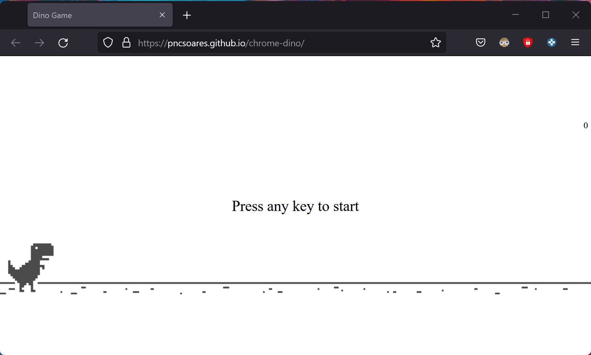

# Chrome Dino

A clone of the Google Chrome's Dinosaur game 🦕



# How to play

1. Open the following URL: https://pncsoares.github.io/chrome-dino/src
1. Press any key to start and then `space` to jump.

# Setup

## Clone repository

Create and go to the directory where you want to place the repository

```bash
  cd my-directory
```

Clone the project

```bash
  git clone https://github.com/pncsoares/chrome-dino.git
```

Go to the project directory

```bash
  cd chrome-dino
```

Open in Visual Studio Code

```bash
  code .
```

# License 

MIT